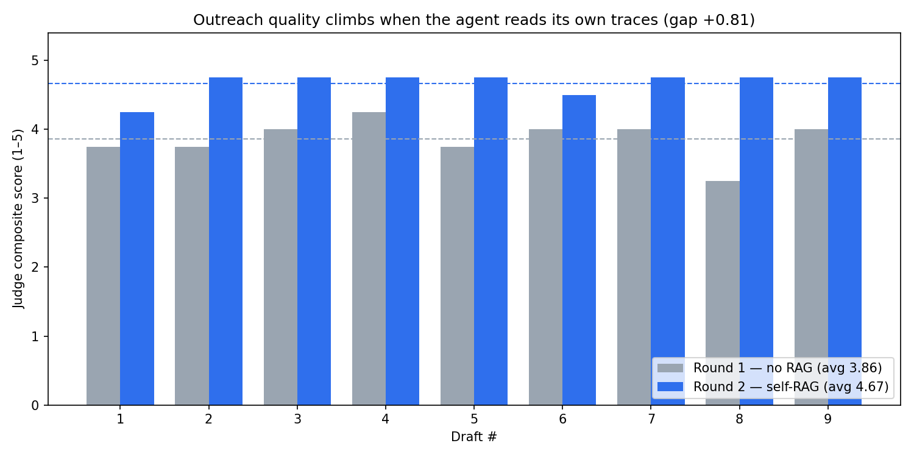

# Job Hunt Signal

An agent that runs a focused, evidence-based job hunt — and **learns to write better outreach from real outcomes in its own traces**. Paste a resume and criteria: it searches verified first-party company boards, filters for freshness and employment type, ranks roles against the resume, and drafts outreach only for contacts whose current employer can be verified. If the evidence is weak, it returns fewer results instead of inventing them.

> Submission for the Arize × Google hackathon (Gemini 3 + Agent Builder + Phoenix).
> **Live app:** https://agentic-job-hunt.vercel.app · **Demo video:** _[add link after upload]_ · **Writeup:** [demo/DEVPOST.md](demo/DEVPOST.md)



*Same resume, same criteria, judge held constant — round 2 retrieves the agent's best past drafts from Phoenix as exemplars. Drafter: Gemini 3.5 Flash (production config), gap +0.39. The same loop lifts the weaker Gemini 2.5 Flash drafter by [+0.81](demo/round_comparison_gemini25.md) — the agent's own memory helps weaker writers most. Regenerate with `python scripts/compare_rounds.py`.*

## Install

```bash
python -m venv .venv
source .venv/bin/activate
pip install -r requirements.txt
cp .env.example .env  # fill in GOOGLE_API_KEY, SERPAPI_API_KEY, PHOENIX_*
```

## Practical product rebuild

The repository is being upgraded from a one-run hackathon demo into a private
job-search workspace. The implementable product plan is in
[`PRACTICAL_JOB_SEARCH_PLAN.md`](PRACTICAL_JOB_SEARCH_PLAN.md); the delivered
foundation and first reusable job-search workflow are documented in
[`docs/PHASE_0_FOUNDATION.md`](docs/PHASE_0_FOUNDATION.md) and
[`docs/PHASE_1_PROFILE_SEARCH.md`](docs/PHASE_1_PROFILE_SEARCH.md). The manual,
durable opportunity radar is documented in
[`docs/PHASE_2_OPPORTUNITY_RADAR.md`](docs/PHASE_2_OPPORTUNITY_RADAR.md). The
first practical application checkpoint is documented in
[`docs/PHASE_3_APPLICATION_PIPELINE.md`](docs/PHASE_3_APPLICATION_PIPELINE.md).
The verified-contact bench and manual outreach workflow are documented in
[`docs/PHASE_4_CONTACT_BENCH.md`](docs/PHASE_4_CONTACT_BENCH.md). The delivered
provider-free grounding, application-material, and exact manual-submission
checkpoints are documented in
[`docs/PHASE_5_APPLICATION_PACK.md`](docs/PHASE_5_APPLICATION_PACK.md).
Hiring progress, terminal outcomes, and the owner-local Today action center are
documented in
[`docs/PHASE_6_OUTCOME_LEARNING.md`](docs/PHASE_6_OUTCOME_LEARNING.md).

The delivered foundation includes migrated Postgres models, private owner
sessions, owner-scoped generic jobs, lease/cancellation safety, capability-aware
readiness, a bounded same-origin proxy, generated API contracts, and mandatory
Postgres CI gates. Practical hunt requests, results, outcomes, and generic
worker dispatch now use encrypted, owner-scoped Postgres state. SQLite remains
only behind the explicit `ENABLE_PRACTICAL_MODE=0` development compatibility
path.

Phase 1 adds a persistent candidate profile, immutable encrypted resume
versions, career targets, approval-gated achievement evidence, and saved
searches. Phase 2 adds a search-only **Scan roles** action, stable native job
identity, immutable posting versions, source-health warnings, deduplication
across saved searches, and a database-only **Today** inbox. Today exposes
unknown facts and supports durable Watch, Dismiss, and restore decisions; it
never searches live sources, reads a resume, discovers contacts, drafts text,
or calls a model merely because the page was opened.

Today defaults to **Recommended** ordering across the complete filtered,
persisted result set before pagination. The order uses only visible categorical
facts: actionable posting/decision state, eligibility, fit band, and confidence;
companies rotate only inside an equal recommendation tier. There is no hidden
fit percentage. **Newest** remains available as an explicit alternative. The
cursor pins the result snapshot, filter scope, order, and assessment inputs; if
the profile, approved evidence, posting, or decision changes between pages, the
API returns safe refresh guidance instead of mixing two rankings. With all saved
searches selected, each role uses the search that matched it most recently;
selecting one search ranks only against that target.

Phase 3A adds an atomic **Pursue** decision. It creates exactly one application,
one open dated next action, and one immutable creation activity, then exposes a
database-only Applications list and dossier. Phase 5 extends that narrow state
machine to `pursuing -> ready_to_apply -> applied`; every transition completes
the prior task, creates exactly one new dated task, and appends an immutable
activity event.

Phase 4A–4D2 add the durable verified-contact bench, its provider-backed worker,
the practical dossier experience, and a safe manual-outreach workspace. Each
pursued application can explicitly and idempotently queue a public-profile
search, retain a 12-person
evidence-backed discovery pool, and atomically publish a deterministic, diverse
bench of up to five. The dossier polls real progress, preserves the last good
bench during refresh failures, shows public evidence and checked dates, and
reports honest shortfalls such as `3/5 verified`. Restricted contacts and closed
postings fail visibly closed. The outreach API pins one completed bench, unlocks
only the strongest role-relevant person plus an optional recruiter with a
distinct purpose, encrypts every exact message revision, and records copy and
manual send assertions separately. It persists the five-business-day follow-up
date, enforces one follow-up, 30-day person cooldowns, company volume limits,
idempotency, and reply-driven pause/stop rules. Reads remain database-only and
nothing sends automatically. The dossier adds an exact-message composer,
clipboard-first copy tracking, separate send confirmation, follow-up timing,
outcome logging, and pause/resume/stop controls while preserving unsaved text
through refresh and ambiguous network failures.

Phase 5 adds a provider-free application workflow before the People workspace.
The **Fit and evidence review** pins one immutable resume and the pursued posting
version, extracts exact `required` and `preferred` JD spans, maps only approved
achievement evidence, and records explicit immutable review events.
**Application materials** then creates an exact tailored-resume diff, company
note, and answers to owner-entered questions with claim-level evidence or
pinned-JD provenance. Unanswerable questions stay visibly blocked; approving
one exact revision creates an immutable non-base resume version. Finally, the
manual-application checklist records `ready_to_apply` and `applied` only against
those exact reviewed materials, a persisted verified first-party destination,
the owner-local applied date, and the next follow-up. Nothing fills or submits
an employer form, and reads never generate or call a model/provider.

Phase 6A records confirmed recruiter screens, interviews, offers, and explicit
terminal outcomes without rewriting the exact submission. Every active role
retains one dated task, while a closed role has a durable outcome and no phantom
next action. Today now loads a separate owner-local action center before the
opportunity inbox, grouping overdue, due-today, and next-seven-day application
work with direct dossier links and complete bucket counts. Interview
appointments now have stable round IDs and immutable reschedule/completion/
cancellation history; the current appointment owns the Today preparation task,
and only a completed first round advances the hiring funnel. If a coarse
screening, manually recorded interview, or offer date was entered incorrectly,
Activity can now append a dated correction while keeping the original and every
prior correction visible. The current stage, task, submission, and outcome are
not rewritten, and later milestones validate against the corrected date. Manual
outreach replies are also stored as their own immutable history. Each one is
linked to the exact initial or follow-up send and exact saved message version,
with an owner-local received date and encrypted optional note. Late and multiple
replies remain recordable after a no-reply result, closed posting, completed
sequence, or later hiring progress without re-enabling outbound messages.

Phase 6B adds a practical **Weekly review**. It surfaces every overdue
application without treating silence as rejection, then records an explicit
Continue or Waiting decision against the exact current action and next date.
Its fixed 14-day application funnel keeps sample sizes, recent censored work,
missing attribution, and late conversions visible. Source, career-track, and
assessment segments use immutable pursuit-time snapshots only. Outreach is
reported by verified contact type and bench position, while contacts two
through five are shown as observed rescue rates—not causal uplift—from exact
initial and follow-up replies.

Phase 6C adds deterministic **Interview preparation** inside each submitted
application dossier. It pins prompts to the exact submission, posting version,
reviewed requirements, approved evidence snapshots, and scheduled interview
round/version. STAR fields remain blank until the owner writes them, private
notes are encrypted and revisioned, and missing evidence is shown as a blocker
instead of being replaced with invented prose. A changed round or evidence
snapshot leaves the prior draft readable but stale and read-only.

Phase 6C also turns `/privacy` into an authenticated data-control workspace.
It downloads deterministic, machine-readable owner data without stored
ciphertext or security metadata; applies a versioned 1–30 day policy to legacy
hunt runs; previews the exact local deletion graph; and permanently deletes the
owner workspace only after an exact typed confirmation and retry-safe request.
Deletion revokes every owner session while leaving other owners and system
state untouched. See [the privacy-control contract](docs/PHASE_6_PRIVACY_CONTROLS.md)
for export omissions, provider-side limits, and downgrade safety.

The separate **Legacy hunt** remains available when you explicitly want the
current end-to-end flow with resume matching, at least five appropriate
referral leads per returned role, and draft generation. Cadence preferences
are stored and timezone-correct, but automatic scan dispatch is deliberately
not connected yet.

For the private local workspace:

```bash
cp .env.example .env
# Replace POSTGRES_PASSWORD= with the output of: openssl rand -hex 24
.venv/bin/python scripts/generate_owner_token.py  # save token; copy printed env values
docker compose build migrate web worker
docker compose up -d postgres
docker compose run --rm migrate
docker compose up web worker frontend
```

Open <http://localhost:3000>, enter the generated private access key, and keep
`ENABLE_PRACTICAL_MODE=1` whenever real provider calls are possible.

If `postgres_data` already exists from the old fixed-password setup, PostgreSQL
does not change that stored role password merely because `.env` changed. Start
only `postgres`, open `psql`, and set the `job_hunt` role to the same generated
value saved in `.env` before starting web or worker:

```bash
docker compose up -d postgres
docker compose exec postgres psql -U job_hunt -d job_hunt
# In psql: \password job_hunt
# Enter the POSTGRES_PASSWORD value twice, then run: \q
```

## Run

```bash
python -m job_hunt_agent.run \
  --resume fixtures/sample_resume.txt \
  --keywords "backend engineer,software engineer,backend developer" \
  --location "India,Remote-India,Bengaluru,Hyderabad" \
  --seniority junior \
  --employment-types full_time \
  --max-age-days 45 \
  --pack backend_india \
  --trace
```

Output is structured JSON: `{ run_id, roles: [...], outreach: [{ role, person, message }, ...] }`. Roles include source, employment type, posting date, source confidence, resume-fit score, and a match reason quoting real job-description evidence.

Add `--trace` to emit OpenTelemetry spans to your Phoenix project, or `--use-mocks` for the no-network smoke loop. The CLI also prints the generated `run_id` so you can correlate the output with a Phoenix trace.

## V2 evidence rules

- `backend_india` contains 22 curated companies with live-verified ATS or first-party career sources.
- Curated hunts do not fall back to paid aggregators. A failed company board degrades to an empty result and a warning.
- Known employment-type mismatches are filtered. A posting with no explicit
  employment evidence remains visible as `unknown` so missing source metadata
  cannot silently hide an otherwise relevant role.
- Referral candidates require current-employer evidence and confidence of at least 0.5. No verified candidate means no draft, plus honest guidance in the UI.
- Past drafts are retrieved by logged outcome first (`introduced`/`replied` before neutral or `no_reply`), with judge score used only as a tiebreaker.

## The self-improvement loop

Three pieces close the loop; each has a verification command:

1. **Seeded corpus** — 18 synthetic past drafts with a documented quality
   rubric ([fixtures/SEED_NOTES.md](fixtures/SEED_NOTES.md)). Upload:
   `python scripts/seed_phoenix.py --project job-hunt-agent --allow-duplicates --verify`
2. **LLM-as-judge eval** — every draft gets four 1–5 sub-scores
   (personalization, specificity, ask, tone); the composite is written onto
   the draft's Phoenix span. Calibrate the judge against handwritten
   good/bad references before trusting it:
   `python scripts/validate_judge.py`
3. **Self-RAG drafting** — `draft_message` queries Phoenix for the
   top-scoring past drafts on the run's keywords (score ≥ 4) and threads
   them into the prompt as exemplars. A/B it:
   `PHOENIX_QUERY_LOOKBACK_HOURS=720 python scripts/compare_rounds.py --trace`
   writes `demo/round_comparison.md` + `.png` and fails if the self-RAG
   round doesn't beat baseline by +0.3 (gate calibrated for the Gemini 3.5
   Flash drafter; both model's charts live in `demo/`).

Dev extras (matplotlib, pytest): `pip install -r requirements-dev.txt`.

## Verify the company registry

The REG Definition of Done is deliberately live and strict: every active company
must return at least one posting with a matching company identity, where the ATS
provides one, and an apply URL on a configured careers domain.

```bash
.venv/bin/python scripts/verify_registry.py --pack backend_india --live --strict-live
```

This command performs network requests and fails on dead or unverified sources.
`pytest tests/test_registry.py` remains hermetic and never performs live checks.

## Run the API and worker

FastAPI now enqueues encrypted hunt requests for a separate worker process. The
HTTP submit path returns immediately; the worker claims the job, runs
`run_hunt`, and atomically saves the final result.

```bash
uvicorn job_hunt_agent.api:app --reload
python -m job_hunt_agent.worker          # second terminal, long-running loop
python -m job_hunt_agent.worker --once   # process one queued run and exit
```

Endpoints:

```
POST   /api/session                 { owner_token } → HttpOnly owner session
POST   /api/hunt                    { resume_text, criteria, pack, provider_consent: true }
                                    → 202 { run_id, status: queued, access_token }
GET    /api/runs/{run_id}           owner session cookie
                                    → queue state, plus result/outcomes after success
POST   /api/runs/{run_id}/cancel    owner session + allowed Origin
POST   /api/runs/{run_id}/outcomes  owner session + allowed Origin (succeeded only)
DELETE /api/runs/{run_id}           owner session + allowed Origin
POST   /api/runs/{run_id}/requeue   owner session + allowed Origin (dead-letter only)
GET/PUT /api/me/profile             owner profile + current base-resume metadata
GET/POST /api/me/resume-versions    immutable encrypted resume versions
GET/POST /api/me/evidence           approval-gated achievement evidence
PATCH  /api/me/evidence/{id}        edit/review evidence with If-Match
GET/POST /api/career-tracks         reusable career targets
GET/PATCH/DELETE /api/career-tracks/{id}
GET/POST /api/saved-searches        pinned criteria, resume, target, and cadence
GET/PATCH/DELETE /api/saved-searches/{id}
GET    /api/saved-searches/{id}/hunt-input
                                    → provider-free exact hunt prefill
POST   /api/saved-searches/{id}/scans
                                    → 202 durable search-only scan (If-Match + idempotency)
GET    /api/scans/{id}              → persisted progress, counts, and safe source warnings
GET    /api/today                   → database-only deduplicated opportunity inbox
GET    /api/today/application-actions
                                    → owner-local overdue, today, and next-7-day application work
GET    /api/opportunities/{id}      → posting facts, versions, provenance, decision history
POST   /api/opportunities/{id}/decision
                                    → pursue, watch, dismiss, or restore (If-Match + idempotency)
GET    /api/applications            → database-only pursuing applications + next actions
GET    /api/applications/{id}       → application dossier + immutable activity
GET    /api/applications/{id}/activity
                                    → database-only immutable activity stream
POST   /api/applications/{id}/activity/{event_id}/corrections
                                    → append a confirmed coarse milestone date correction
GET    /api/applications/{id}/interview-rounds
                                    → saved round timeline + application ETag for scheduling
POST   /api/applications/{id}/interview-rounds
                                    → schedule one round (application If-Match; returns round ETag)
POST   /api/applications/{id}/interview-rounds/{round_id}/events
                                    → reschedule, complete, or cancel (round If-Match + idempotency)
GET    /api/applications/{id}/interview-preparation
                                    → exact evidence-backed prompts + owner-authored STAR drafts
POST   /api/applications/{id}/interview-preparation/revisions
                                    → append an encrypted, versioned, retry-safe owner draft
GET    /api/applications/{id}/application-pack
                                    → database-only current + latest-reviewed grounding projection
POST   /api/applications/{id}/application-packs
                                    → pin pursued JD/resume and extract exact requirement spans
POST   /api/applications/{id}/application-packs/{pack_id}/revisions
                                    → save one immutable coverage/evidence review revision
POST   /api/applications/{id}/application-packs/{pack_id}/events
                                    → mark the exact current revision reviewed
GET    /api/applications/{id}/contacts
                                    → database-only contact plan, progress, bench, and evidence
POST   /api/applications/{id}/contact-searches
                                    → 202 durable provider search (If-Match + idempotency)
GET    /api/applications/{id}/outreach
                                    → database-only manual sequence, recipients, and timeline
POST   /api/applications/{id}/outreach-sequences
                                    → pin the completed bench and start wave 1
POST   /api/applications/{id}/outreach-sequences/{sequence_id}/messages
                                    → save one exact immutable message version
POST   /api/applications/{id}/outreach-sequences/{sequence_id}/events
                                    → record copy, manual send, outcome, pause/resume, or stop
GET    /health                      → { ok: true }
GET    /web-ready                   → DB + migration readiness for web traffic
GET    /ready                       → DB migration + compatible worker readiness
```

The practical frontend does not store or require the returned access token.
Owner-scoped run links work in a new tab or after a reload through the opaque
HttpOnly session cookie. The response field remains temporarily for the
development-only legacy API compatibility path.

Configure persistence and CORS via env:

- `DATABASE_URL` — Postgres shared by the practical web and worker processes.
- `LEGACY_HUNT_API_MODE` — `enabled`, `read_only`, or `disabled`. Production
  defaults to read-only; use the practical workspace for new work.
- `LEGACY_HUNT_API_SUNSET` / `LEGACY_HUNT_DEPRECATION_URL` — validated
  compatibility sunset metadata. The production link must use HTTPS.
- `JOB_HUNT_OWNER_TOKEN_HASH` — SHA-256 of the generated private workspace
  access key. The environment name is retained for compatibility.
- `JOB_HUNT_PRIVACY_RECEIPT_SECRET` — stable 32+ character server-only HMAC
  secret so deletion idempotency survives owner-login credential rotation.
- `JOB_HUNT_DATA_KEYS` — comma-separated `key-id:Fernet-key` values. The first
  key encrypts new requests, results, and outcome notes; retain older keys
  during rotation.
- `ALLOWED_ORIGINS` — comma-separated CORS allowlist (default dev origins for localhost 3000/5173).
- `ENABLE_TRACING` — set to `1` so API-triggered hunts emit Phoenix spans.
- `ENABLE_TRACE_DRAFT_CONTENT` — keep `0` for user traffic. Prompts, model
  outputs, and draft text are private by default.
- `GEMINI_PAID_SERVICE_ACK` — production must set `1` manually after
  confirming the Google API key uses paid Gemini quota.
- `RETENTION_CLEANUP_INTERVAL_SECONDS` — API-triggered expired-data cleanup
  interval. Set `3600` in production. `/health` remains a lightweight liveness
  check during a database outage.
- `JOB_HUNT_DB_PATH` — legacy-only SQLite path when practical mode is explicitly
  disabled; practical production does not require or read it.

`criteria` accepts `employment_types` and `max_age_days`; `pack` defaults to
`backend_india`.

Resume-bearing requests are encrypted before Postgres writes, stay available
only while queued/running/retryable, and are erased when the worker succeeds,
the user cancels, the request expires, or the run is deleted. Results and
outcome notes are encrypted too, and the entire run expires after 30 days via
API-triggered cleanup or `python -m job_hunt_agent.cleanup`. Users can cancel
active runs or delete a run immediately from the review page. See the frontend
`/privacy` page for provider disclosure and retention limits.

Privacy mode intentionally prevents new user draft text from entering the
shared Phoenix corpus. Self-RAG continues to use the curated seed corpus; an
owner-scoped learning store is required before production can learn from
individual users' drafts safely.

## Operations

Production and recovery procedures live in the
[operational runbooks](docs/runbooks/README.md): backup/restore,
deploy/rollback, source outages, incident recovery, legacy history import, and
the truthful manual Chromium/Firefox/WebKit QA matrix. The provider-free
deployment smoke is:

```bash
.venv/bin/python -m scripts.deployment_smoke \
  --base-url https://jobs.example.com \
  --expect-legacy-mode read_only
```

Pass database credentials through `DATABASE_URL` in the environment so they do
not appear in process arguments. Backup and downgrade tools refuse unsafe
in-place operations and require a migration-current, identity-matched archive.

## Hosted deployment status

`render.yaml` keeps the deployment on Render's free web tier and enables one
embedded durable worker in that process. A user request wakes the web and
worker together; interrupted leases recover after a restart. The bridge always
supports provider-free role scans and also supports explicit contact searches
when `SERPAPI_API_KEY` is configured. Missing contact configuration never
disables role scans, and the bridge never claims legacy provider jobs.
`/web-ready` gates web traffic on a reachable, migrated database; authenticated
`/api/health` exposes the exact live capabilities.

Before routing production traffic:

1. Provision managed Postgres and require TLS in `DATABASE_URL` with
   `sslmode=require`, `verify-ca`, or `verify-full`.
2. Keep `MIGRATE_ON_START=1` for the single hosted web instance. Its startup
   wrapper runs `python -m alembic upgrade head` and exits instead of serving if
   migration fails. Multi-instance deployments should use one dedicated
   migration release step instead.
3. For the free private deployment, keep
   `ENABLE_EMBEDDED_SCAN_WORKER=1` and
   `JOB_HUNT_WORKER_KINDS=scan_saved_search,discover_contacts`. Contact search
   is advertised only when its SerpAPI configuration passes runtime checks.
   When an always-on standalone
   worker is introduced, disable the embedded worker and give the new service
   the same database and encryption keys.
4. Configure the required Render environment variables, including an exact
   HTTPS `ALLOWED_ORIGINS` entry with no trailing slash.
5. Require the GitHub quality checks. Render is configured with
   `autoDeployTrigger: checksPass`, so a failing commit is not auto-deployed.
6. Monitor `https://<service>.onrender.com/web-ready` for web availability and
   authenticated `/api/health` for scan capability. `/ready` remains the
   strict signal for the currently active durable queue workload.

Render's free web service can sleep after inactivity, so the first request may
have a cold-start delay and unattended schedules need a separate wake
mechanism. A paid always-on background worker remains the strong-beta topology,
not a requirement for interactive private scans. Follow
[the deployment runbook](docs/runbooks/deploy-rollback.md) when changing worker
topology. Production startup rejects missing secrets, non-Postgres databases,
localhost or wildcard CORS origins, mocks, and private draft-content tracing.
Operators must additionally use TLS-only database and HTTPS origin settings.

One-time Vercel setup:

```bash
cd frontend
cp .env.example .env.local
vercel link
vercel env add API_BASE_URL production
vercel --prod
```

Set the server-only `API_BASE_URL` to `https://<service>.onrender.com` (shown at
the top of the Render service page). After Vercel prints the production URL,
update Render's `ALLOWED_ORIGINS` env var to that exact HTTPS origin without a
trailing slash.

Queued smoke test:

```bash
API=http://localhost:8000  # web and worker must share DATABASE_URL
ORIGIN=http://localhost:3000
OWNER_TOKEN=<the one-time token saved in your password manager>
curl $API/health
curl -c /tmp/job-hunt-owner.cookies -X POST $API/api/session \
  -H "Origin: $ORIGIN" \
  -H "Content-Type: application/json" \
  -d "{\"owner_token\":\"$OWNER_TOKEN\"}"
curl -b /tmp/job-hunt-owner.cookies -X POST $API/api/hunt \
  -H "Origin: $ORIGIN" \
  -H "Content-Type: application/json" \
  -H "Idempotency-Key: smoke-$(date +%s)" \
  -d @fixtures/sample_hunt_request.json

RUN_ID=<run_id from the hunt response>

python -m job_hunt_agent.worker --once

curl -b /tmp/job-hunt-owner.cookies $API/api/runs/$RUN_ID
DRAFT_ID=<draft_id from the successful GET response>
curl -X POST $API/api/runs/$RUN_ID/outcomes \
  -b /tmp/job-hunt-owner.cookies \
  -H "Origin: $ORIGIN" \
  -H "Content-Type: application/json" \
  -d "{\"outcomes\":[{\"draft_id\":\"$DRAFT_ID\",\"outcome\":\"replied\",\"notes\":\"deploy smoke\"}]}"
```

`/api/hunt` should return queued state promptly. The final `GET` should move
from `queued`/`running` to `succeeded` after a provider-capable worker processes
the run, and the outcome POST should work only after success. The free hosted
blueprint processes saved-search scans only; contact discovery and legacy
provider hunts still require a separately configured provider-capable worker.

## Abridged response shape

`POST /api/hunt` returns queue state, not the completed hunt:

```json
{
  "run_id": "<trace-correlated id>",
  "status": "queued",
  "stage": "queued",
  "attempt_count": 0,
  "max_attempts": 3,
  "access_token": "<returned once; send only as a bearer token>",
  "reused": false
}
```

After the worker succeeds, `GET /api/runs/{run_id}` returns:

```json
{
  "run_id": "<trace-correlated id>",
  "status": "succeeded",
  "hunt_result": {
    "run_id": "<trace-correlated id>",
    "roles": [
      {
        "company": "<verified company>",
        "title": "<title from posting>",
        "url": "<first-party apply URL>",
        "location": "<location from posting>",
        "summary": "<posting-derived summary>",
        "match_reason": "<resume overlap plus quoted JD evidence>",
        "source": "greenhouse",
        "apply_urls": ["<first-party apply URL>"],
        "posted_at": "<source-provided date>",
        "source_updated_at": "<source-provided last update>",
        "employment_type": "full_time",
        "fit_score": 0.42,
        "confidence": 1.0
      }
    ],
    "outreach": []
  },
  "outcomes": []
}
```

An empty `outreach` array means no current employee met the verification bar;
the UI explains how to continue the search manually.

## Layout

```
job_hunt_agent/        ADK agent, schemas, pipeline runner, tracing
  api.py               FastAPI surface (enqueue, status, cancel, outcomes)
  database.py          SQLAlchemy engine/session lifecycle and migration head
  hunt_repository.py   Encrypted owner-scoped Postgres hunt aggregate
  profile_repository.py Profile, resume-version, and career-target persistence
  evidence_repository.py Encrypted approval-gated achievement evidence
  application_pack_repository.py Provider-free JD/evidence grounding revisions
  saved_search_repository.py Saved criteria and timezone projections
  sqlalchemy_owner_workspace.py Transaction-owning profile/search API adapter
  job_queue.py         Generic Postgres jobs, leases, events, and heartbeats
  models/              Owner, profile, radar, application/outcome, contact, outreach, and pack tables
  evals.py             LLM-as-judge draft scoring (V9)
  mcp_client.py        Phoenix past-draft retrieval (self-RAG)
  persistence.py       Explicit practical-mode-off SQLite compatibility path
  worker.py            Postgres practical worker + isolated legacy dispatcher
  tools/               search_jobs, find_referrals, draft_message (+ mocks)
frontend/              Next.js private job-search workspace and legacy hunt UI
fixtures/              sample resume, criteria, seed corpus, judge references
scripts/               seed_phoenix.py, validate_judge.py, compare_rounds.py
demo/                  round comparison chart, demo script, Devpost writeup,
                       canonical_run.json (offline backup of one real run)
tests/                 pytest suite (offline; live tests skip without keys)
PLAN.md                Full plan and task history
```

## License

MIT — see [LICENSE](LICENSE).
